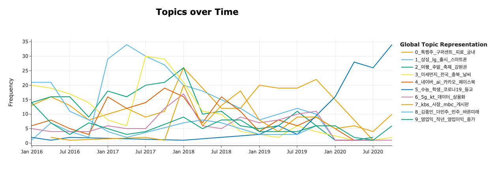
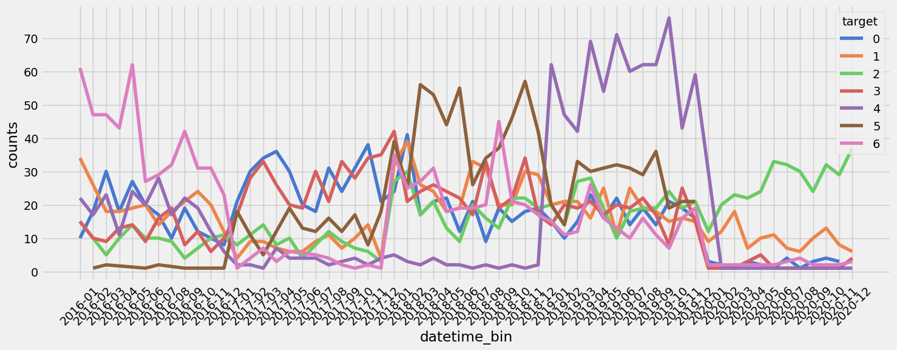

# Notes on Growing 24/4

## Mon

**#Baseline**. 대회는 사실상 오늘 참여. 7개의 카테고리마다 천 개씩 샘플링을하여 총 7천개의 학습 데이터 마련. 베이스라인 코드를 돌렸을 때, F1 score가 리더보드에서 0.8384. 평가 데이터에 대한 점수와 큰 차이가 나지 않는다. 테스트 데이터의 분포와 평가 데이터 분포 사이의 차이가 크지 않은 듯.  

[**#BERTopic**](https://maartengr.github.io/BERTopic/index.html)을 오래 간만에 사용했다. EDA 목적으로. 기억을 되살리기 위해서 API를 다시 찾아보는데 시간이 걸리긴 했지만, 확실히 다양한 프레임워크 사용에 이전 훨씬 익숙해진 것 같다. 처음보다는 빠르게 적응 완료. 데이터셋에 시간 정보가 있어 활용해 보았다. 따라서 Dynamic Topic Modeling을 사용. Class 별로 토픽을 보기도 했지만, 너무 정보가 뻔해서 많은 인사이트를 얻지는 못했다. 무튼 DTM을 사용했을 때, 토픽 변화에 유의미한 차이가 있음을 발견. 노이즈로 판단되는 토픽은 모든 클래스, 모든 시간에 걸쳐 균형있게 분포함. 아마도 전체 학습 데이터에 대해 g2pk를 사용한 후, 무작위로 샘플링한 듯. 정작 데이터 분포는 Uniform하지만 시간 별로 보았을 때는 그렇지 않다. 시간을 고려했을 때, 특정 시기에 특정 토픽에 대해 보다 편향될 가능성이 있어 보인다. 가령 위 이미지에서 '정치'에 해당되는 8번 토픽을 생각해보면 16년 4분기 즈음에 언급 빈도가 급증한다. 또한 2017년 내내 다른 토픽에 비해 더 높은 빈도를 보유. 모델 관점에서 해석해보면, 학습된 모델이 새로운 데이터를 예측할 때 해당 시기에 나타난 토큰을 마주칠 때 '정치'라고 예측하지 않을까?    

##   
  
## Tue

**#텍스트의 시간 의존성**을 고려해야 될까? BERTopic 결과를 이어서 생각 중. 카테고리별 빈도를 시계열 형태로 나타냄. 실제로 클래스의 분포는 시간 별로 상이했다. 오늘 생각했던 내용, 시간 정보를 명시하지 않더라도 텍스트에는 간접적으로 나타나지 않을까? 축구선수를 예로 들자면, 박지성하면 20년 전 축구고 기성용은 10년 전, 손흥민은 요즘. 모델은 학습할 때, 텍스트에 간접적으로 남아 있는 시간 패턴을 유추할 수 있을 것 같다. 생각이 얽혀서 나중에 깊이 생각해보자.   

**#노이즈**도 학습시켜야 될까 아닐까. 현재 학습 데이터 뿐만 아니라 테스트 데이터에도 G2P 변환을 통한 노이즈가 주입되어 있음. 노이즈에 강건할 수 있도록 학습 데이터에도 노이즈를 추가 주입시켜야 될까 아니면 학습은 매우 깔끔한 데이터로만 진행해야되는 걸까. 비슷한 맥락에서 다른 팀원이, 인위적으로 변환된 Label을 CleanLab으로 제거했을 때 오히려 리더보드 점수가 떨어졌다고 한다. 노이즈 마저 학습하는게 오히려 이득일 수도. 다시 질문. 만약 노이즈를 주입한다면 원 문장을 제거해줘야 되는 걸까 아니면 같이 학습시켜야 되는 걸까.  

**#로마자**로 Back translation. 학습 데이터가 귀한 상황이기에 노이즈 데이터를 정상적인 문장으로 복원시키고자 함. 단순하게 번역기를 사용했을 때는 성능이 좋지 않았다. 고민하던 와중에 로마자 변환을 생각. 실제로 로마자 표기를 Bard에 원래 문장을 복원시켜달라고 하니 완벽하진 않지만 의미가 충분히 유지된 문장으로 바꿔줬다. 문제는, 의미를 유추할 수 있는 LLM을 제외하곤 방법을 마련하는게 막막함. 한글을 로마자로 변환해주는 라이브러리는 꽤 있으나, 반대의 경우는 찾기 힘들다. 간혹 있더라도 Rule-Based는 성능이 좋지 않다. Seq2seq 모델을 사용해볼까도 했지만, 가성비가 있는 것 같지는 않다. 현업 관점에서 시도를 할지 말지 함께 생각해보자.    

##   
  
## Wed

**#W&B**로 Custom Monitoring 함수 제작. Lightning을 썼을 때는 적당히 추상화가 되어 있어 logging을 위치를 지정하기 수월했지만, HuggingFace의 `Trainer`는 그렇지 않았음. 헌데 찾아보니 다양한 Callback 기능을 제공하긴 한다. 또 상당히 직관적이어서 함수 안에서 어떤 데이터를 사용할 수 있는지만 알면 진입장벽은 넘었다. 일단 transformers의 `WandbCallback` 객체를 상속해서 Customizing할 수 있다. 여러 상황에 맞는 Hook이 있는듯. 평가 도중이나 학습이 끝난 뒤에 특정한 작업을 요청할 수 있다. [참고했던 코드](https://docs.wandb.ai/guides/integrations/huggingface#custom-logging-log-and-view-evaluation-samples-during-training). 'predictions'라는 객체를 사용할 수 있고, 클래스를 정의할 때 콜백 안에서 사용할 데이터를 추가할 수 있다. 학습 보다는 에러 분석 목적이 강했기 때문에, 평가 이후에 Confusion matrix와 PR Curve를 만들고, 또한 예측 결과, 실제 값 그리고 해당되는 문장을 파악할 수 있도록 테이블을 logging했다. 대체로 잘 동작하나 버그가 있긴 했음. 따로 떼어낸, 그러니깐 고정된 평가용 데이터를 불러왔을 때는 나타나진 않았지만, Trainer에 넣기 직전에 `train_test_split`으로 평가용 데이터를 만들었을 때는 테이블에 문장이 누락되는 경우가 발생함.  

[**#PORORO**](https://github.com/kakaobrain/pororo)를 쓰고 싶었지만 쓰질 못했다. 점수를 올리고자 데이콘 대회에 공유된 코드를 참고했다. 비슷한 문제에 대해서 pororo를 사용한 코드를 발견함. 카카오브레인에서 제작했고 한국어 텍스트에 대해서 다양한 증강 기능을 제공하는 라이브러리. 헌데 설치가 안된다. README에 명시한 것처럼 `torch==1.6.0` 버전을 지정해서 설치했지만 설치가 되지 않는다. 폐기.   

[**#nlpaug**](https://github.com/makcedward/nlpaug)를 사용해서 BERT 기반으로 증강. PORORO를 폐기하고 GitHub에서 디깅하다가 발견. 다양한 증강 기능을 제공하고 있고 무엇보다 Transformer 기반으로 문장을 새롭게 바꿔주는게 인상 깊었다. 학습 데이터에 대해서 `klue/bert-base`를 사용했을 때 가장 만족스럽게 문장을 변형시켜 줌. 오히려 더 큰 모델을 썼을 때는 변환이 되질 않는 문제가 있었음. 한 문장을 바꿀 때 0.1초 정도 소요되었고 전체 데이터를 증강했을 때 오히려 리더보드 점수는 떨어졌다. 너무 변환 정도를 높이 잡았던 게 아닐까?`(aug_p=0.3)`  

##   
    
## Thu

**#PAPAGO API**를 써봤지만 너무 부족했다. Google 번역기를 사용해서 BT를 했을 때, 일부 문장들이 의미적으로 꽤 벗어나는 것을 확인했다. 동일한 문장에 대해서 파파고 번역기를 적용해보니 퀄리티가 훨씬 좋았다. 특히 중국어 간체를 거쳐갔을 때가 가장 좋다는 생각이 들었다. 그래서 BT 목적으로 파파고 API를  써봤는데, 할당량을 너무 금방 채운다. 400개를 요청했지만 중간에 이미 바닥이 났다.  

**#Error Analysis**. 앞서 W&B로 구현한 커스텀 Logger를 바탕으로 에러를 분석했다. 모델이 대체로 사회, 경제, IT과학 순으로 분류를 잘 못하고 있었다. 에러가 발생한 문장을 직접 확인했을 때, 사람 또한 판단히 어려운 샘플들이 두루 있었다. 이러한 형태의 문장들을 깊이 학습할 수 있도록 증강을 시도했다. 먼저 분할 비율을 0.5, 0.3, 0.2로 달리하면서 예측에 실패한 문장들을 선별했다. 이러한 문장들에 대해서 BERT 기반의 증강을 적용했고, 또한 의도적으로 문장을 중복시켜 이러한 부분에 대해서 모델이 과적합 되도록 시도했다. 결과적으로 리더보드 점수는 올랐다. 물론 대회 막바지 제출이라 추가적인 분석을 하지는 못했다. 또한 여전히 고민거리다. 텍스트 임베딩을 어떻게 잘할 수 있을까. 여기에 대한 엔지니어링을 좀더 학습해 봐야될 것 같다.   

##   
  
## Fri

[**#MLflow**](https://mlflow.org/)를 배우자. [DVC](https://dvc.org/)에 대해 알게 되었다. 대회에 참여하면서 GitHub을 활용하지 않았던게 아쉽다. 데이터 버전을 관리하면서 슬랙이나 노션을 이용했었는데 너무 별로였다. 데이터 파일을 주고 받는데 이름이 너무 복잡해서 헷갈리기 쉽상이었다. 실제로 파일을 잘못 건네서 작업이 꼬였던 경우도 있다. Git을 통해서 변동 내용을 확인했더라면 얼마나 좋았을까, 데이터 뿐만 아니라 데이터 증강 코드도 공유했더라면 더 좋았을 것이다. 대회를 마치고서야 여유가 생기니 슬랙에서 DVC에 대한 내용이 눈에 들어왔다. 데이터 버전 관리. 무엇보다 변성윤 마스터가 남긴 댓글이 눈에 선하다. '실무에선 잘 안쓴다. 대신 MLflow'. 모니터링 도구로 W&B를 쓰고 있었는데 이마저도 MLflow를 더 선호하는 경향이 있다고 한다. 얘기를 듣고 다음 대회나 프로젝트 부터는 MLflow를 쓰고자 한다.   

